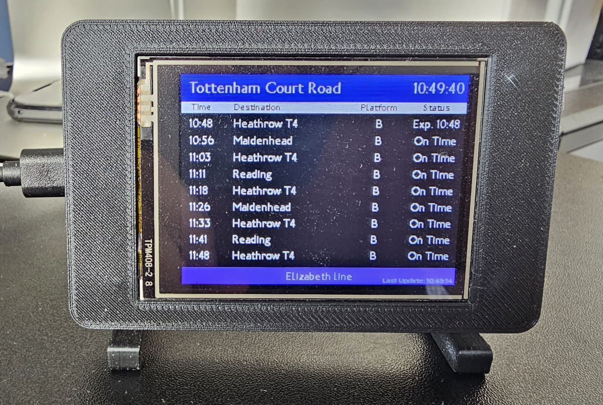

# Departure Board



## Description

This project creates a real-time train departure board showing the estimated departure and arrival time of trains in London.

## Features

- **Real-time update:** Fetches live train departure data every minute from [Tfl Open Data](https://api.tfl.gov.uk/)
- **Configurable:** Easily change the station and line displayed through a web interface

## Hardware

1. **ESP32 Dev Module**: Any ESP32 board with WiFi compabilities
2. **Display Module (320x240):**
   - **Recommended:** Cheap Yellow Display - ESP32-2432S028 (Display with ESP32 integrated)
   - **Alternatives:** Any 320x240 display supported by LVGL

## Getting Started

### 1. Install VS Code and PlatforIO Extension

1. Download and install VS Code
2. Install PlatformIO IDE Extension in VS Code

### 2. Clone this Repository

```
git clone https://github.com/shr00m335/london-departure-board.git
cd london-departure-board
```

### 3. Open Project in VS Code

Open the project directory in VS Code

### 4. Hardware Configuration (Skip if you are using CYD)

| ESP32 Pin | Display Pin |
| --------- | ----------- |
| 21        | BLK         |
| 12        | MISO        |
| 13        | MOSI        |
| 14        | SCLK        |
| 15        | CS          |
| 2         | DC          |

### 5. Configure TFT_eSPI

Edit `User_Setup.h` for your own pin configuration, driver and color mode.

### 6. Build and Upload the Code

Click the arrow icon at the top right hand color of the IDE to upload the code

## Configuration

The departure board can be configured by connect the ESP32 to a computer. It uses a web interface to control the settings.

1. Connect the ESP32 with a computer

2. Go to https://shr00m335.github.io/departure-board-configuration-web/ or host your own website from https://github.com/shr00m335/departure-board-configuration-web

3. Follow the instruction on the website

## Known Issues

1. When the API response is too large, there may be an error in parsing the content causing the board not updating

2. Some train departures are missing

## Reference

1. https://randomnerdtutorials.com/lvgl-cheap-yellow-display-esp32-2432s028r/
2. https://docs.lvgl.io/master/intro/getting_started/
3. https://api.tfl.gov.uk/
